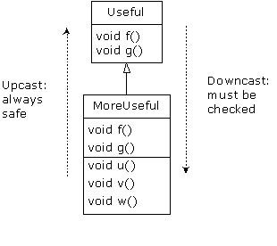

# 7.8 通过继承进行设计


学习了多态性的知识后，由于多态性是如此“聪明”的一种工具，所以看起来似乎所有东西都应该继承。但假如过度使用继承技术，也会使自己的设计变得不必要地复杂起来。事实上，当我们以一个现成类为基础建立一个新类时，如首先选择继承，会使情况变得异常复杂。

一个更好的思路是首先选择“组合”——如果不能十分确定自己应使用哪一个。组合不会强迫我们的程序设计进入继承的分级结构中。同时，组合显得更加灵活，因为可以动态选择一种类型（以及行为），而继承要求在编译期间准确地知道一种类型。下面这个例子对此进行了阐释：

```
//: Transmogrify.java
// Dynamically changing the behavior of
// an object via composition.

interface Actor {
  void act();
}

class HappyActor implements Actor {
  public void act() {
    System.out.println("HappyActor");
  }
}

class SadActor implements Actor {
  public void act() {
    System.out.println("SadActor");
  }
}

class Stage {
  Actor a = new HappyActor();
  void change() { a = new SadActor(); }
  void go() { a.act(); }
}

public class Transmogrify {
  public static void main(String[] args) {
    Stage s = new Stage();
    s.go(); // Prints "HappyActor"
    s.change();
    s.go(); // Prints "SadActor"
  }
} ///:~
```

在这里，一个`Stage`对象包含了指向一个`Actor`的引用，后者被初始化成一个`HappyActor`对象。这意味着`go()`会产生特定的行为。但由于引用在运行期间可以重新与一个不同的对象绑定或结合起来，所以`SadActor`对象的引用可在a中得到替换，然后由`go()`产生的行为发生改变。这样一来，我们在运行期间就获得了很大的灵活性。与此相反，我们不能在运行期间换用不同的形式来进行继承；它要求在编译期间完全决定下来。

一条常规的设计准则是：用继承表达行为间的差异，并用成员变量表达状态的变化。在上述例子中，两者都得到了应用：继承了两个不同的类，用于表达`act()`方法的差异；而`Stage`通过组合技术允许它自己的状态发生变化。在这种情况下，那种状态的改变同时也产生了行为的变化。

## 7.8.1 纯继承与扩展

学习继承时，为了创建继承分级结构，看来最明显的方法是采取一种“纯粹”的手段。也就是说，只有在基类或“接口”中已建立的方法才可在派生类中被覆盖，如下面这张图所示：


可将其描述成一种纯粹的“属于”关系，因为一个类的接口已规定了它到底“是什么”或者“属于什么”。通过继承，可保证所有派生类都只拥有基类的接口。如果按上述示意图操作，派生出来的类除了基类的接口之外，也不会再拥有其他什么。

可将其想象成一种“纯替换”，因为派生类对象可为基类完美地替换掉。使用它们的时候，我们根本没必要知道与子类有关的任何额外信息。如下所示：


也就是说，基类可接收我们发给派生类的任何消息，因为两者拥有完全一致的接口。我们要做的全部事情就是从派生向上转换，而且永远不需要回过头来检查对象的准确类型是什么。所有细节都已通过多态性获得了完美的控制。

若按这种思路考虑问题，那么一个纯粹的“属于”关系似乎是唯一明智的设计方法，其他任何设计方法都会导致混乱不清的思路，而且在定义上存在很大的困难。但这种想法又属于另一个极端。经过细致的研究，我们发现扩展接口对于一些特定问题来说是特别有效的方案。可将其称为“类似于”关系，因为扩展后的派生类“类似于”基类——它们有相同的基础接口——但它增加了一些特性，要求用额外的方法加以实现。如下所示：


尽管这是一种有用和明智的做法（由具体的环境决定），但它也有一个缺点：派生类中对接口扩展的那一部分不可在基类中使用。所以一旦向上转换，就不可再调用新方法：


若在此时不进行向上转换，则不会出现此类问题。但在许多情况下，都需要重新核实对象的准确类型，使自己能访问那个类型的扩展方法。在后面的小节里，我们具体讲述了这是如何实现的。

## 7.8.2 向下转换与运行期类型识别

由于我们在向上转换（在继承结构中向上移动）期间丢失了具体的类型信息，所以为了获取具体的类型信息——亦即在分级结构中向下移动——我们必须使用 “向下转换”技术。然而，我们知道一个向上转换肯定是安全的；基类不可能再拥有一个比派生类更大的接口。因此，我们通过基类接口发送的每一条消息都肯定能够接收到。但在进行向下转换的时候，我们（举个例子来说）并不真的知道一个几何形状实际是一个圆，它完全可能是一个三角形、方形或者其他形状。



为解决这个问题，必须有一种办法能够保证向下转换正确进行。只有这样，我们才不会冒然转换成一种错误的类型，然后发出一条对象不可能收到的消息。这样做是非常不安全的。

在某些语言中（如C++），为了进行保证“类型安全”的向下转换，必须采取特殊的操作。但在Java中，所有转换都会自动得到检查和核实！所以即使我们只是进行一次普通的括弧转换，进入运行期以后，仍然会毫无留情地对这个转换进行检查，保证它的确是我们希望的那种类型。如果不是，就会得到一个`ClassCastException`（类转换异常）。在运行期间对类型进行检查的行为叫作“运行期类型识别”（RTTI）。下面这个例子向大家演示了RTTI的行为：

```
//: RTTI.java
// Downcasting & Run-Time Type
// Identification (RTTI)
import java.util.*;

class Useful {
  public void f() {}
  public void g() {}
}

class MoreUseful extends Useful {
  public void f() {}
  public void g() {}
  public void u() {}
  public void v() {}
  public void w() {}
}

public class RTTI {
  public static void main(String[] args) {
    Useful[] x = {
      new Useful(),
      new MoreUseful()
    };
    x[0].f();
    x[1].g();
    // Compile-time: method not found in Useful:
    //! x[1].u();
    ((MoreUseful)x[1]).u(); // Downcast/RTTI
    ((MoreUseful)x[0]).u(); // Exception thrown
  }
} ///:~
```

和在示意图中一样，`MoreUseful`（更有用的）对`Useful`（有用的）的接口进行了扩展。但由于它是继承来的，所以也能向上转换到一个`Useful`。我们可看到这会在对数组`x`（位于`main()`中）进行初始化的时候发生。由于数组中的两个对象都属于`Useful`类，所以可将`f()`和`g()`方法同时发给它们两个。而且假如试图调用`u()`（它只存在于`MoreUseful`），就会收到一条编译期出错提示。

若想访问一个`MoreUseful`对象的扩展接口，可试着进行向下转换。如果它是正确的类型，这一行动就会成功。否则，就会得到一个`ClassCastException`。我们不必为这个异常编写任何特殊的代码，因为它指出的是一个可能在程序中任何地方发生的一个编程错误。

RTTI的意义远不仅仅反映在转换处理上。例如，在试图向下转换之前，可通过一种方法了解自己处理的是什么类型。整个第11章都在讲述Java运行期类型识别的方方面面。
